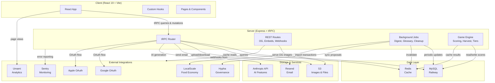

# Architecture Overview

ReGen Civics is a full-stack web application built with React, tRPC, Express, and MySQL. Here's how the pieces fit together.

## System Diagram

## Request Flow

When a player loads the app:

1. Browser requests the React app from the server.
2. React loads and initializes. On login, it calls the OAuth endpoint.
3. Server validates OAuth, creates a JWT, sets it as a secure cookie.
4. All subsequent requests include the JWT. Server middleware verifies it and loads the user into context.
5. React calls tRPC queries and mutations with the JWT in headers.
6. tRPC handlers receive the request, pull user from context, query the database, return data.
7. React re-renders based on the response.

Flow: Browser -> Express -> OAuth Provider -> JWT -> Context -> tRPC Handler -> MySQL -> Response.

## Authentication Flow

ReGen Civics uses OAuth for zero-friction signup:

1. Player clicks "Sign In with Google" or "Sign In with Apple".
2. Browser redirects to `/api/auth/oauth/{provider}`.
3. Server redirects to OAuth provider (Google or Apple).
4. Player logs in with their account at the provider.
5. Provider redirects back to `/api/auth/callback/{provider}` with an authorization code.
6. Server exchanges code for an access token.
7. Server calls the provider's user info endpoint to fetch player details.
8. If player doesn't exist, create a new account in the database.
9. Server generates a JWT and sets it as a secure, httpOnly cookie.
10. Browser is redirected back to the app. Subsequent requests automatically include the JWT.

All user data (name, email, avatar) is synced from the OAuth provider on each login. The player never enters a password.

## Game Loop

The game runs on a nightly schedule:

1. Every night at 2 AM UTC, a background job wakes up.
2. It reads all contributions from the past 24 hours (tracked in the database).
3. It calculates a percentile-ranked contribution score for each player (0-99).
4. It applies trust multipliers based on endorsements, account age, and gratitude received.
5. Scores are written back to the database. Player profiles reflect the new score immediately.
6. Four times per year (on seasonal boundaries), a Harvest job runs:
   - Calculates the new $ReGen token emission.
   - Distributes tokens to contributors based on percentile score.
   - Distributes tokens to bioregions based on local food economy activity.
   - Distributes tokens to the treasury for land project grants.
   - Applies composting: inactive players have their scores decayed.
7. After Harvest, Stewards and Sages can create proposals on Hypha to adjust game variables for the next season.

## Data Flow

All data flows through a single pattern:

1. Database schema is defined in `drizzle/schema.ts`. This is the source of truth.
2. Migrations are numbered, immutable, and stored in `migrations/`. Never modify an applied migration.
3. All database queries are written in `server/db.ts` using Drizzle ORM. No raw SQL in application code.
4. tRPC procedures call db functions and return typed results.
5. React components call tRPC and store results in component state or React Query cache.
6. Background jobs also use the same db functions, ensuring consistency.

Pattern: Schema -> Migration -> Query Function -> tRPC -> React.

All queries return typed results. The type system is your guard rail.

## Background Jobs

These run on schedules and keep the system healthy:

**Daily (2 AM UTC)**
- Contribution Score Calculation: Reads all tracked contributions, calculates percentiles, updates player scores.

**Weekly**
- Digest Generation: Compiles community activity into email digests, sent to subscribed players.
- Glossary Refresh: Updates the public glossary of terms.

**Monthly**
- Cleanup: Deletes expired sessions, orphaned comments, inactive draft posts.

**Seasonal (4x per year, on solstices and equinoxes)**
- Harvest Distribution: Emits new $ReGen, distributes to contributors and bioregions, applies composting.
- Proposal Sync: Syncs all Hypha proposals into the database for display in the UI.

Each job is idempotent. If it fails halfway, running it again won't double-process or corrupt data.

## Tech Stack Reference

- **Client**: React 19, Vite, TypeScript, Tailwind CSS, shadcn/ui
- **Server**: Express, tRPC, TypeScript
- **Database**: MySQL on Railway, Drizzle ORM
- **Cache**: Redis (for session store, real-time data)
- **Storage**: Cloudflare R2 (S3-compatible)
- **Email**: Resend (for transactional emails)
- **AI**: Anthropic API (for content generation and embeddings)
- **Auth**: Google OAuth 2.0, Apple OAuth 2.0
- **Governance**: Hypha (on-chain proposals and voting)
- **Integrations**: LocalScale (food economy data), Sentry (error tracking), Umami (analytics)
- **Hosting**: TBD (Vercel for frontend, Railway for backend)

## Key Principles

- **Type Safety**: TypeScript everywhere. The compiler catches bugs before they ship.
- **Immutable Migrations**: Never modify or delete applied migrations. Always create new ones.
- **No Raw SQL**: All queries go through Drizzle. This prevents injection attacks and keeps things queryable.
- **Idempotent Jobs**: Background jobs are safe to retry. They won't corrupt data.
- **User Context**: All requests carry the authenticated user. Use it in every query.
- **Cache Invalidation**: Redis is used sparingly for read-heavy queries. Invalidate explicitly, never rely on TTL.

## For New Developers

Start here:

1. Read this document to understand how pieces fit together.
2. Check the repo structure. Navigate to the codebase and see the folders.
3. Pick a small fix from FIXES_TO_MAKE. Read the relevant code.
4. Run tests locally. Get them passing.
5. Open a PR. The team will review and merge.

You can learn the full system in a week of focused work. Start small.
